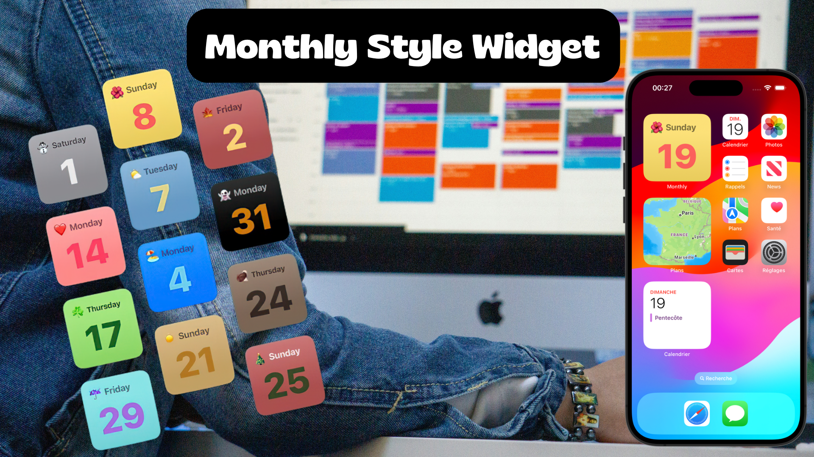

# Monthly Style Widget

## Description

The Monthly Style Widget is a WidgetKit Extension designed to enhance your home screen with a dynamic and visually appealing widget. The widget changes its background color, text, and emoji each month, providing a fresh look and feel that reflects the current month.

## Features

- **Dynamic Monthly Themes**: Automatically updates the widget's background color, text, and emoji to match the current month.
- **Daily Updates**: Refreshes daily to display the correct day and weekday in a visually engaging format.
- **Light and Dark Mode Support**: Adapts to your device's appearance settings, ensuring readability and aesthetic appeal in both light and dark modes.

## Technologies Used

- **WidgetKit Extension**: Enables the creation of complex and interactive widgets for iOS. Utilized for defining the widget's timeline, appearance, and behavior.
- **SwiftUI**: A modern framework for building declarative user interfaces across all Apple platforms, used for creating the widget's layout and animations.
- **Xcode**: An integrated development environment (IDE) for macOS that provides the tools needed for software development, including building, testing, and debugging.
- **Swift**: A powerful and intuitive programming language for macOS, iOS, watchOS, and tvOS development, used to write the entire codebase for the widget.

## Installation

To install and run the Monthly Style Widget on your device:

1. Clone the repository from GitHub.
2. Open the project in Xcode.
3. Build and run the project on your iOS device or simulator.

## Credits

- This project is a tutorial from Sean Allen's course on [Teachable](https://seanallen.teachable.com/courses/enrolled/1858387): "WidgetKit - iOS17".
- Original project idea and design by Sean Allen.

## Author

- [alcode111](https://github.com/alcode111)
